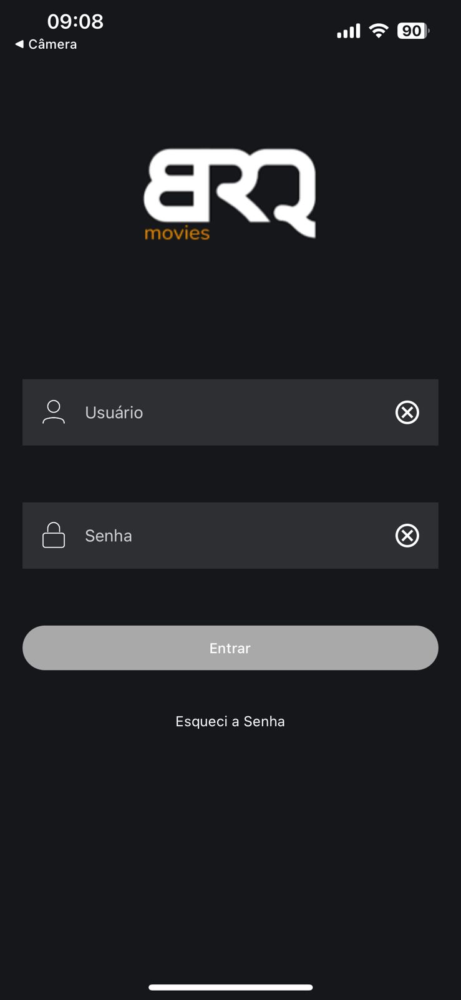
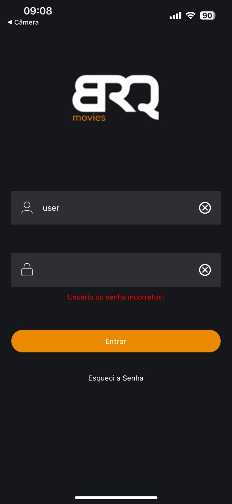
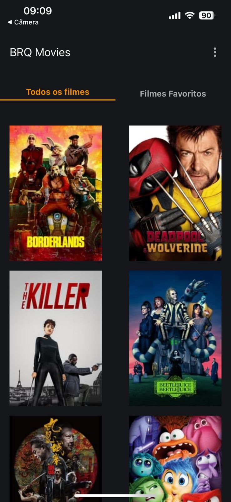
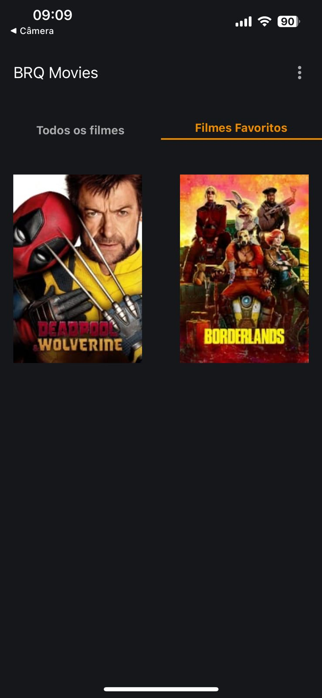
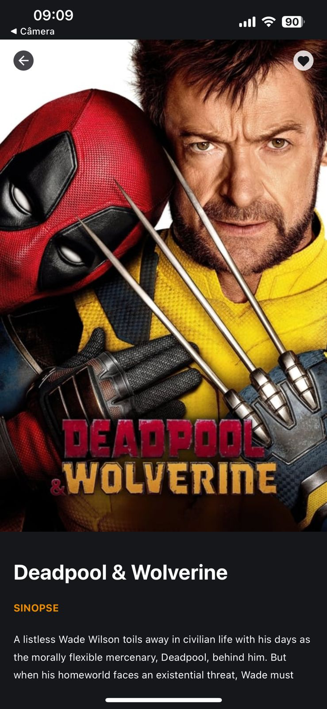
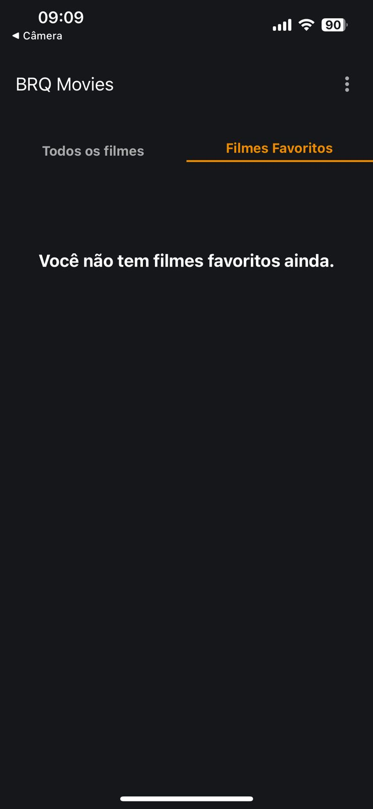
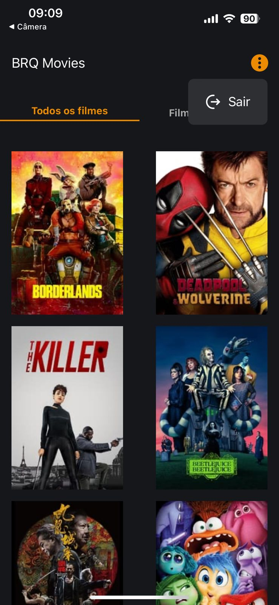
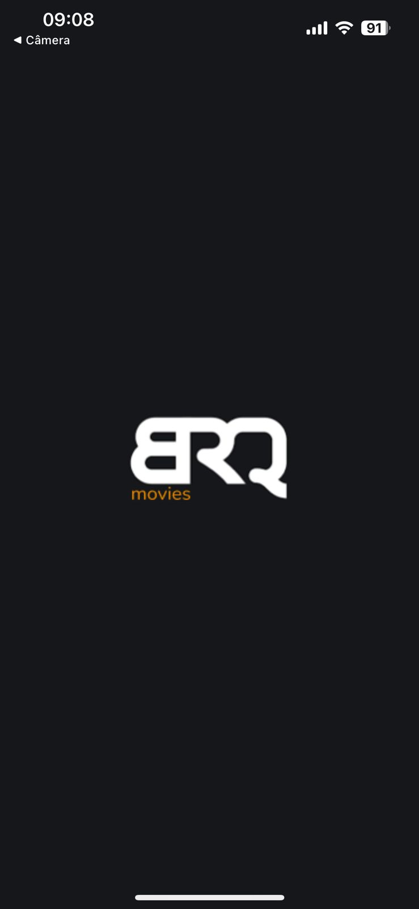

# 🎬 BRQMovies App

BRQMovies é um aplicativo de visualização de filmes que permite aos usuários explorar os filmes mais populares, adicionar filmes aos favoritos, visualizar detalhes, e navegar por diferentes categorias. O aplicativo é desenvolvido utilizando **React Native** e **Expo** e consome a API **The Movie DB** para buscar informações sobre filmes.

## 📱 Screenshots

### 1. Tela de Login



### 2. Tela de Login com erro



### 3. Tela Home



### 4. Tela Favoritos com filmes



### 5. Tela Detalhes do Filme



### 6. Tela Favoritos Vazio



### 7. Tela Home com Menu Clicado



### 8. Tela de Splash



## 🚀 Tecnologias Usadas

- **React Native** - para o desenvolvimento do aplicativo mobile.
- **Expo** - para simplificar o fluxo de desenvolvimento.
- **TypeScript** - para garantir tipagem estática e melhor manutenção do código.
- **Styled Components** - para estilização dos componentes React Native.
- **React Navigation** - para navegação entre telas.
- **Superagent** - para requisições HTTP à API do The Movie DB.
- **The Movie DB API** - para fornecer dados sobre filmes.
- **Jest** e **React Native Testing Library** - para testes unitários.

## 🎬 API Usada

Este projeto utiliza a API **The Movie DB** (TMDB) para fornecer informações sobre filmes, incluindo detalhes, imagens, classificações e muito mais. Para saber mais sobre a API, acesse:

- [The Movie DB API](https://developers.themoviedb.org/3)

## 🧪 Testes Unitários

Os testes unitários foram implementados utilizando:

- **Jest** - para a execução dos testes.
- **React Native Testing Library** - para testar componentes React Native.

### Como rodar os testes:

```bash
yarn test
```

## 📋 Funcionalidades

- **Login:** Permite aos usuários fazer login com validação de credenciais.
- **Home:** Exibe os filmes mais populares do momento.
- **Favoritos:** Lista de filmes favoritos do usuário.
- **Detalhes do Filme:** Exibe detalhes como sinopse, elenco, e trailer de um filme específico.
- **Navegação por Menu:** Permite ao usuário navegar entre as telas Home, Favoritos e Detalhes.
- **Favoritos Vazio:** Exibe uma mensagem quando a lista de favoritos está vazia.
- **Erro de Login:** Mostra uma mensagem de erro se as credenciais de login estiverem incorretas.

## ⚙️ Configuração para Iniciar o Projeto

Siga os passos abaixo para configurar o projeto em sua máquina local:

### 1. Clone o repositório:

```bash
git clone https://github.com/luishenriqueramalho/brqmovies.git
cd brqmovies
```

### 2. Instale as dependências:

```bash
yarn install
```

### 3. Configure a chave da API The Movie DB:

# Crie um arquivo .env na raiz do projeto ou altere o env.exemple e adicione sua chave da API:

```bash
API_KEY=YOUR_API_KEY_HERE
```

### 4. Inicie o projeto com Expo:

```bash
yarn start --reset-cache
```
